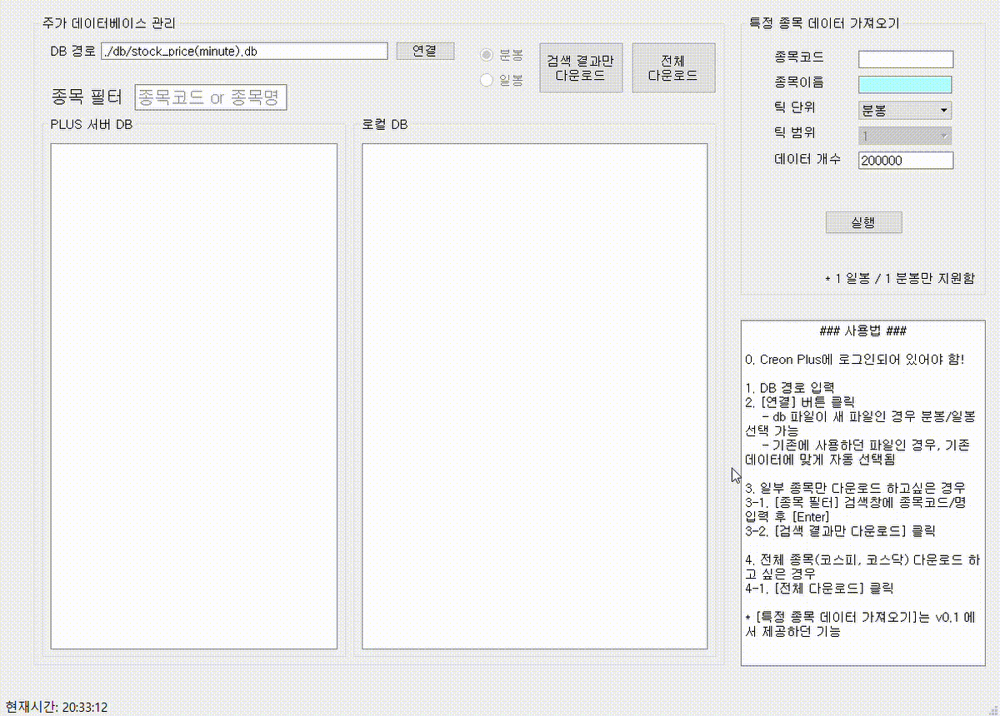
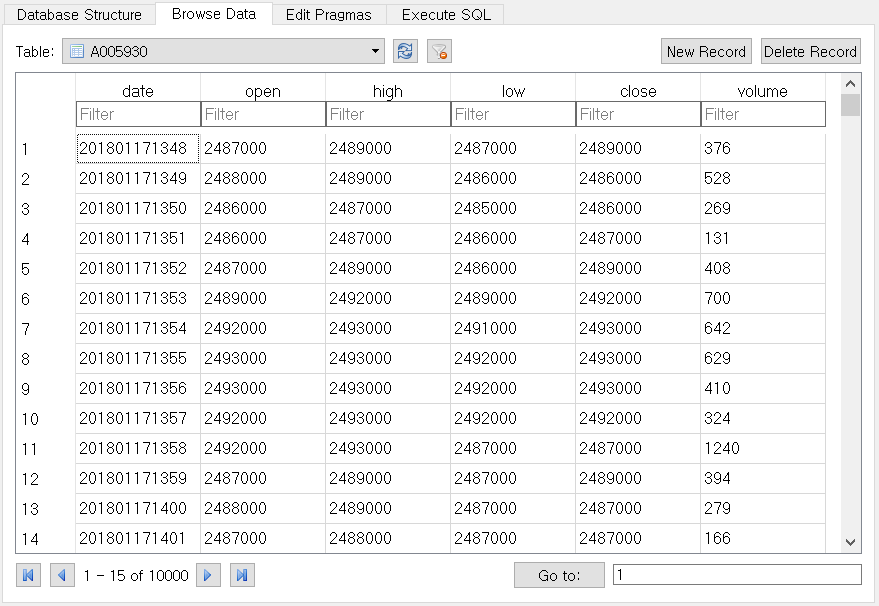

# Creon-Datareader
대신증권의 HTS인 CREON의 Plus API를 사용하여 주가 데이터를 받아오는 PyQt 기반의 프로그램입니다.  
가져온 데이터는 .db 파일로 저장되며, 지속적으로 데이터베이스에 Upsert할 수 있도록 구현되어있습니다.

만약 오늘부터 과거 2년치 1분 데이터를 받아 저장하였다면,  
내일 해당 데이터를 조회하면 1일치의 데이터만 insert하여 데이터를 축적할 수 있습니다.

# ※주의: 수정주가를 받아오기때문에 데이터 축적시 과거데이터와 수정주가비율 차이가 불가피합니다.

## Preview
##### 실행화면

##### 분 단위 데이터 저장 형식 (DB Browser for SQLite 실행 화면)

date를 포함한 모든 값은 integer입니다.

## 실행 환경 세팅

우선 [CREON Plus] 공식 웹사이트를 참고하여 `계좌 개설`, `CREON HTS 설치` 등의 절차를 진행하여야 합니다.
CREON Plus가 32bit 환경에서 지원되기 때문에 32bit Python이 필요합니다. Anaconda를 이용할 것을 권장드립니다.

[CREON Plus]:http://money2.creontrade.com/e5/mboard/ptype_basic/plusPDS/DW_Basic_Read.aspx?boardseq=299&seq=35&page=1&searchString=&prd=&lang=8&p=8833&v=8639&m=9505

1. Anaconda 32-bit 설치

만약 Anaconda 64-bit을 사용하고 있는 경우

- 32-bit 추가 설치 또는,

- `set CONDA_FORCE_32BIT`을 이용하여 32-bit 가상환경을 만들어야 합니다.
    
2. 32-bit anaconda `python=3.6` 가상환경에서
	`conda install`을 이용하여 `pyqt5`, `sqlite3`, `pandas`, `pywin32` 설치
    `conda install`이 안되는 모듈은 `pip`로 설치하시면 됩니다.

## 개발 환경
OS: `WINDOW 10`

Python: `Python3.6.4` in `Anaconda3(build version 3.4.1) 32bit`
`pandas 0.22.0` `pyqt: 5.6.0` `pywin32: 222` `sqlite: 3.22.0`

## NOTE
1. 일봉에 대해, ohlcv_only 체크 해제 시 아래 항목들을 추가로 받아옵니다.
	1. 상장주식수
	1. 외국인주문한도수량: 1999년 부터 데이터 존재. (잘못 기록된 데이터 존재함)
	1. 외국인현보유수량: 1999년 부터 데이터 존재. (잘못 기록된 데이터 존재함)
	1. 외국인현보유비율: 1999년 부터 데이터 존재.
	1. 기관순매수: 2004년 부터 데이터 존재.
	1. 기관누적순매수: 2004년 1월 2일을 시작으로 '기관순매수'를 누적한 값.

##### **데이터 제한** (18.02.23 기준)
	이 프로그램은 일봉, 분봉의 데이터만 받도록 구현되어있습니다.
	Creon Plus API에서 데이터 요청 시점으로부터
	1분봉 약 18.5만개(약 2년치 데이터) 조회 가능
	5분봉 약 9만개(약 5년치 데이터) 조회 가능

    1일봉의 경우 제한 없습니다.

### 참고 사이트
1. 파이썬으로 배우는 알고리즘 트레이딩
	https://wikidocs.net/book/110
2. CREON Plus
	http://money2.creontrade.com/E5/WTS/Customer/GuideTrading/CW_TradingSystemPlus_Page.aspx?p=8815&v=8633&m=9505
